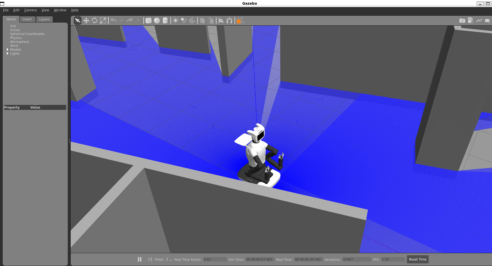
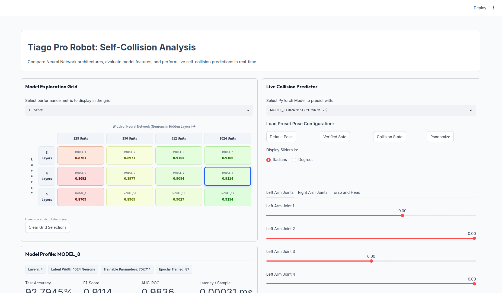
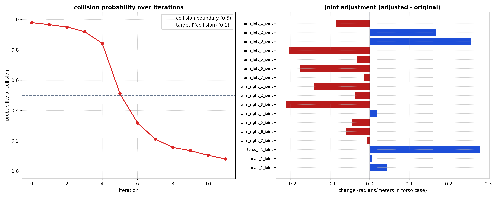

# TIAGo Pro Self-Collision Avoidance & Prediction

This workspace contains code for dataset generation, model training, evaluation, and an interactive dashboard for predicting self-collisions of the **TIAGo Pro robot** (17 Degrees of Freedom). It allows you to train and evaluate both **XGBoost** and **PyTorch Neural Networks** to predict whether a given joint configuration is safe or results in a collision.


---


## Environment Setup & Installation

All required packages and dependencies are listed in [requirements.txt](requirements.txt). 

To install the dependencies in your active virtual environment, run:

```bash
pip install -r requirements.txt
```

---

## Running the Streamlit Dashboard

An interactive dashboard is provided to explore the trained models, compare their performance against the XGBoost baseline, and test configurations live.



To launch the Streamlit app:
```bash
streamlit run app.py
```

### Dashboard Features:
*   **Model Exploration Grid:** A dynamic, HSL-color-coded heatmap comparing the performance of 12 neural network architectures (varying in depth from 3 to 5 layers and width from 128 to 1024 units) across multiple metrics (Accuracy, F1-Score, Latency, etc.).
*   **Model Profile & Configuration:** Deep-dive into any selected model's layers, confusion matrix, and parameters. Includes a comparative study on class balancing showing how weighted cross-entropy helps prevent physical robot damage by optimizing recall.
*   **Live Collision Predictor:** An interactive panel where you can use sliders to adjust the 17 joints of the TIAGo Pro (in degrees or radians). You can load preset configurations (Home, Verified Safe, Collision, Random) and see live predictions and inference latency from both the selected Neural Network and the XGBoost baseline.
*   **Model vs. Baseline Comparison:** A detailed table directly comparing metrics and speed.

---

## Script Directory

### 1. `generate_collision_dataset.py`
*   **Purpose:** A ROS2 node that samples random joint positions within limits and uses the MoveIt `/check_state_validity` service to check for self-collision.
*   **Output:** Generates a CSV file containing joint coordinates, a binary `collision` indicator, and the `num_contacts` count.
*   **Usage:**
    ```bash
    python3 generate_collision_dataset.py --output tiago_collision_dataset.csv --samples 1000 --seed 42
    ```

### 2. `train_xgboost.py`
*   **Purpose:** Trains and evaluates an XGBoost classifier as a baseline model on the 1M dataset.
*   **Usage:**
    ```bash
    python3 train_xgboost.py
    ```

### 3. `train_nn.py`
*   **Purpose:** Trains a multi-layer PyTorch Neural Network to predict self-collisions.
    *   Features: Early stopping with configurable patience, TensorBoard logging (`runs/`), class weighting to handle imbalance, and a post-training evaluation & sensitivity analysis.
*   **Usage:**
    ```bash
    python3 train_nn.py
    ```

### 4. `evaluate_nn.py`
*   **Purpose:** Loads a trained PyTorch model, evaluates it against the test partition, and performs a **sensitivity analysis**
*   **Configuration:** To evaluate a different model checkpoint, edit the script and modify the `MODEL_PATH` variable (line 53):
    ```python
    MODEL_PATH = 'models/model_1.pt'  # Change to the filename of the model checkpoint you want to evaluate
    ```
    Ensure that the network architecture (number of layers and their width) matches this of a model.
*   **Usage:**
    ```bash
    python3 evaluate_nn.py
    ```

### 5. `avoid_collision.py`
*   **Purpose:** Takes a starting 17-DoF robot configuration, uses a pre-trained PyTorch model to check if it results in a collision, and if so, performs **gradient-based optimization** (gradient descent on the collision logit) to iteratively adjust the joint angles to a collision-free pose. 
    *   Features: Respects physical joint limits (clipping after each step), supports standard gradient descent, and provides an optional `use_importance_weighting` flag to scale joint steps based on the average absolute gradients (importance score) from the sensitivity analysis.
*   **Usage:**
    ```bash
    python3 avoid_collision.py
    ```
    * There are 3 predefined collision sets that the optimiser then iteratively adjusts to reduce collision risk below 10%.
---



## TIAGo Pro Joint Configurations (17 DoF)

The models take a 17-dimensional vector representing the following joints (in order):
1.  **Left Arm Joints (1-7):** `arm_left_1_joint` to `arm_left_7_joint`
2.  **Right Arm Joints (1-7):** `arm_right_1_joint` to `arm_right_7_joint`
3.  **Torso Lift:** `torso_lift_joint` (meters)
4.  **Head Joints (1-2):** `head_1_joint` and `head_2_joint`
